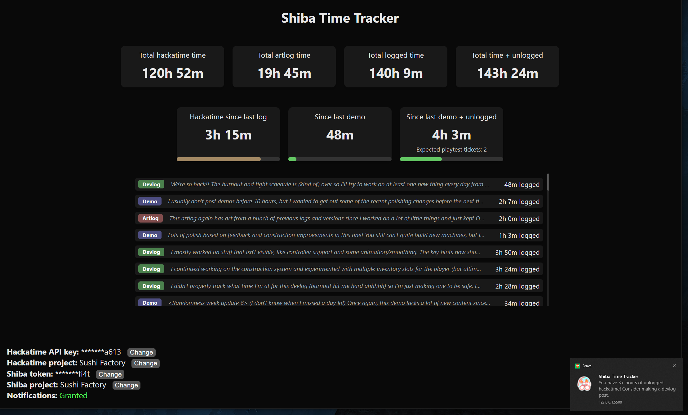

# Shiba time tracker

Silly little single-page time tracker for Hackatime and [Shiba](https://shiba.hackclub.com).  

Because the Shiba API has restrictive CORS, there's a simple Express server in `server/server.js` that proxies requests and serves the static HTML page.  
There's also a Vercel serverless function to proxy requests for Vercel deployment.

